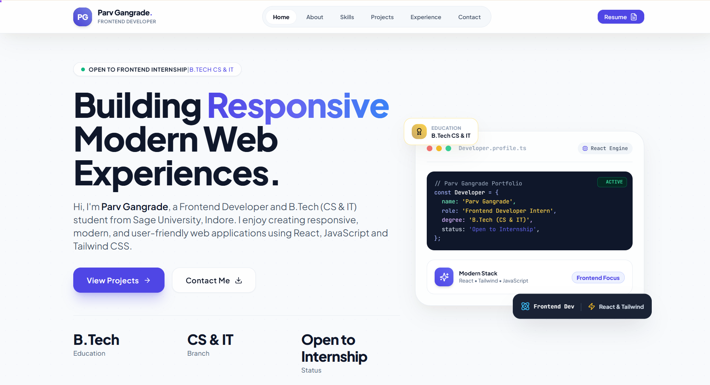
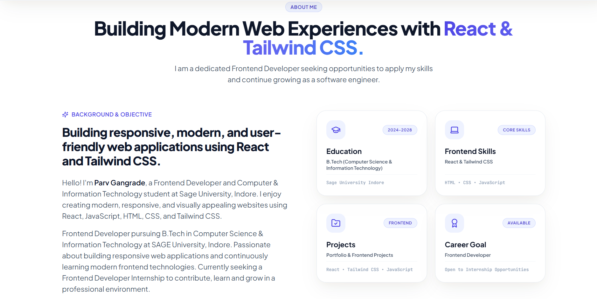
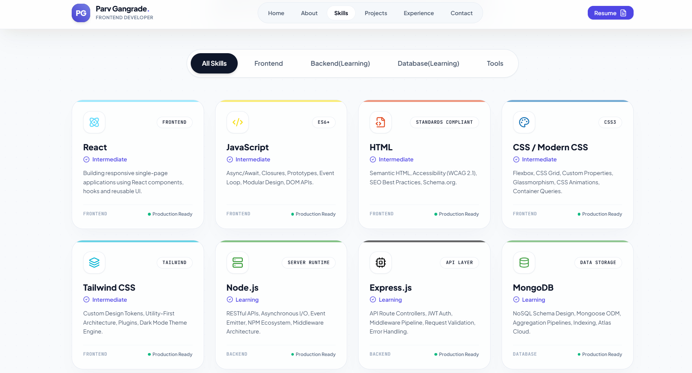
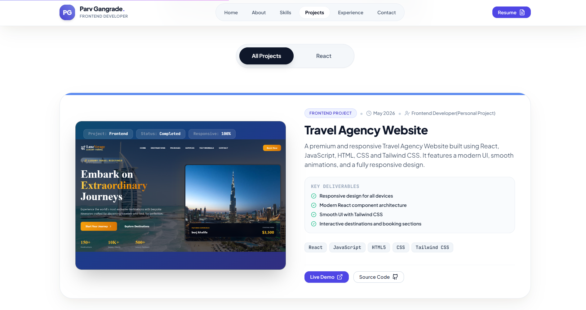
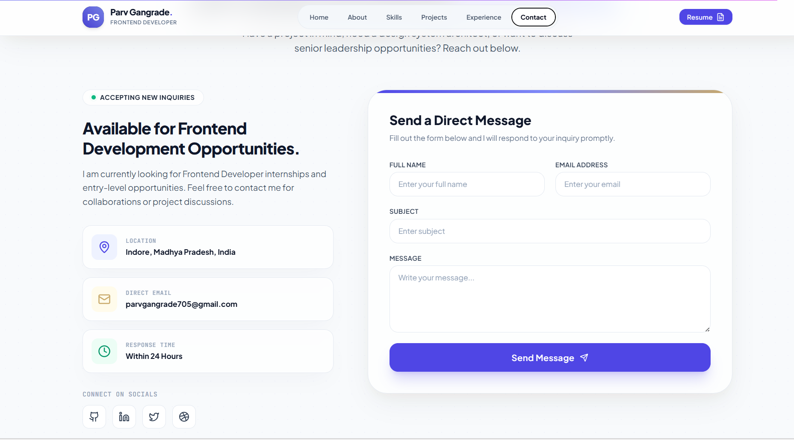
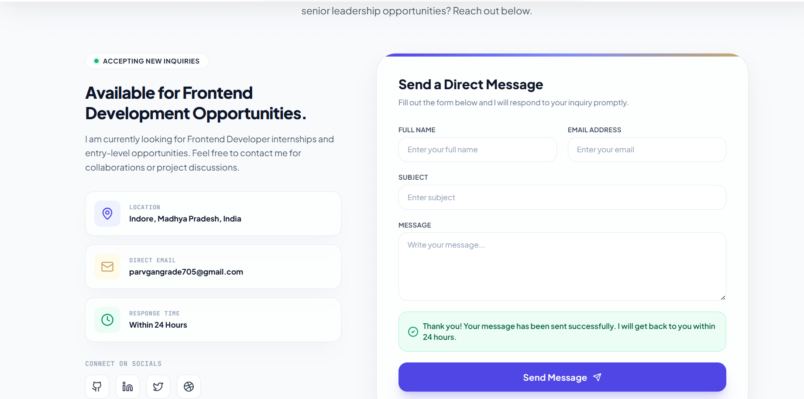

# 🚀 Parv Gangrade - Frontend Developer Portfolio

A modern full-stack portfolio website built using React, Tailwind CSS, Framer Motion, Express.js, MongoDB, and deployed on Vercel & Render.

---

# 🌐 Live Demo

## Frontend (Vercel)

https://portfolio-foundation-gray.vercel.app/#

## GitHub Pages

https://parv89.github.io/cognevance_portfolio-foundation/

## Backend (Render)

https://portfolio-foundation.onrender.com

---

# ✨ Features

- Responsive Design
- Modern UI/UX
- Animated Components
- Skills Section
- Projects Section
- Contact Form
- MongoDB Integration
- Render Backend
- Vercel Deployment
- GitHub Pages Deployment

---

# 🛠 Tech Stack

## Frontend

- React
- JavaScript
- Tailwind CSS
- Framer Motion
- Lucide React

## Backend

- Node.js
- Express.js

## Database

- MongoDB Atlas

## Deployment

- Vercel
- Render
- GitHub Pages

---

# 📂 Project Structure

```
portfolio-foundation/
│
├── public/
├── server/
├── src/
├── screenshots/
├── README.md
└── package.json
```

---

# ⚙ Installation

## Frontend

```bash
npm install
npm run dev
```

## Backend

```bash
cd server
npm install
npm run dev
```

---

# 📸 Screenshots

## Home



---

## About



---

## Skills



---

## Projects



---

## Contact



---

## Contact Form Success



---

# 📚 Learning Experience

During this project I learned:

- React Component Architecture
- Tailwind CSS
- Responsive Design
- Express.js
- MongoDB Atlas
- REST API
- Git & GitHub
- Deployment using Vercel
- Deployment using Render

---

# 💡 Suggestions

This internship helped me improve my frontend and backend development skills. Working on deployment, API integration, and responsive UI gave me practical industry experience.

---

# 👨‍💻 Author

**Parv Gangrade**

Frontend Developer

B.Tech Computer Science & Information Technology

SAGE University Indore